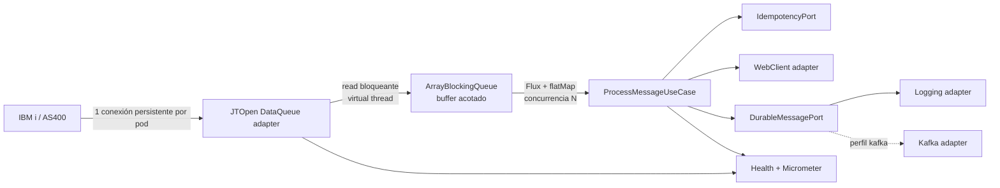

# IBM i Data Queue Consumer — ejemplo con Java 25

Proyecto independiente que muestra cómo consumir una **IBM i / AS400 Data Queue** con JTOpen, una sola conexión persistente por pod y procesamiento reactivo concurrente. No usa Apache Camel.

## Qué demuestra

- Java 25 y Spring Boot 4.1.1 con Spring WebFlux.
- Gradle 9.7.1, Groovy DSL y Wrapper incluido.
- Arquitectura hexagonal: dominio y casos de uso no dependen de JTOpen, WebClient ni Kafka.
- Una instancia de `Jt400DataQueueMessageSource` mantiene una sola conexión Data Queue por pod.
- Un reader bloqueante corre en un virtual thread dedicado.
- `ArrayBlockingQueue` actúa como buffer acotado; `put()` bloquea al reader cuando el consumidor no alcanza, aplicando backpressure sin perder mensajes en memoria.
- Procesamiento posterior con Reactor y concurrencia configurable mediante `flatMap`.
- Reconexión con exponential backoff, límite máximo y jitter.
- Apagado graceful: deja de leer, drena el buffer y espera los mensajes en vuelo hasta el timeout.
- WebClient con propagación de `X-Correlation-ID`.
- Puerto durable con adaptador Kafka opcional (`kafka`) o adaptador local de logging.
- Idempotencia en memoria para el ejemplo; en producción el puerto puede implementarse con Redis o una base de datos.
- Métricas Micrometer, Prometheus, Actuator y health indicator de la conexión.
- Perfil `local` con Data Queue falsa y una simulación predeterminada de 50 000 mensajes.

## Arquitectura



La dependencia apunta hacia dentro: los adaptadores implementan puertos de aplicación y el dominio no conoce infraestructura.

## Requisitos

- JDK 25. El build declara una Java toolchain 25; Gradle puede provisionarla automáticamente.
- No hace falta instalar Gradle: se usa `./gradlew`.

## Ejecutar localmente

El perfil local no abre conexiones externas. Genera exactamente 50 000 mensajes sintéticos, desactiva la llamada HTTP y usa el adaptador durable de logging.

```bash
./gradlew bootRun --args='--spring.profiles.active=local'
```

Estado y métricas:

```bash
curl http://localhost:8080/actuator/health
curl http://localhost:8080/actuator/metrics/as400.messages.processed
curl http://localhost:8080/actuator/prometheus
```

Para cambiar el volumen o ritmo del fake:

```bash
FAKE_MESSAGE_COUNT=100000 FAKE_MESSAGE_INTERVAL=1ms \
  ./gradlew bootRun --args='--spring.profiles.active=local'
```

## Ejecutar las pruebas

```bash
./gradlew clean test
```

Las pruebas cubren backoff, idempotencia/errores, el pipeline concurrente con buffer pequeño y la generación de 50 000 mensajes únicos.

## Conectar a IBM i

Nunca guardes credenciales en Git. Entrégalas mediante el gestor de secretos de la plataforma:

```bash
export AS400_HOST=ibmi.example.internal
export AS400_USERNAME=service_user
export AS400_PASSWORD='from-a-secret-manager'
export AS400_QUEUE_PATH=/QSYS.LIB/MYLIB.LIB/INPUT.DTAQ
export EXTERNAL_API_BASE_URL=https://api.example.internal
export EXTERNAL_API_PATH=/messages
java -jar build/libs/as400-dataqueue-consumer-example-1.0.0.jar
```

Variables principales:

| Variable | Predeterminado | Descripción |
|---|---:|---|
| `CONSUMER_BUFFER_CAPACITY` | `1024` | Máximo de mensajes residentes en el buffer |
| `CONSUMER_CONCURRENCY` | `16` | Procesamientos reactivos simultáneos |
| `AS400_READ_TIMEOUT` | `5s` | Espera de cada lectura JTOpen |
| `AS400_BACKOFF_INITIAL` | `1s` | Primera espera de reconexión |
| `AS400_BACKOFF_MAXIMUM` | `30s` | Tope de reconexión |
| `AS400_BACKOFF_MULTIPLIER` | `2.0` | Crecimiento exponencial |
| `AS400_BACKOFF_JITTER` | `0.20` | Variación aleatoria, de 0 a 1 |
| `CONSUMER_SHUTDOWN_TIMEOUT` | `30s` | Tiempo máximo para drenar al apagar |

### Consideración de entrega

Una Data Queue remueve la entrada cuando la lectura tiene éxito. Por eso el ejemplo publica a un puerto durable después de la llamada HTTP, pero una caída exacta entre lectura y persistencia todavía puede perder el mensaje. Para garantías fuertes en producción, usa un patrón de inbox/outbox respaldado por una base de datos, o escribe primero al puerto durable y procesa desde allí. La idempotencia en memoria tampoco se comparte entre réplicas; reemplaza `IdempotencyPort` por Redis/DB con una restricción única y TTL.

## Kafka opcional

Activa el perfil `kafka` para sustituir el adaptador de logging:

```bash
KAFKA_BOOTSTRAP_SERVERS=localhost:9092 KAFKA_TOPIC=as400.messages \
  java -jar build/libs/as400-dataqueue-consumer-example-1.0.0.jar \
  --spring.profiles.active=kafka
```

## Contenedor

```bash
docker build -t as400-dataqueue-consumer-example .
docker run --rm -p 8080:8080 \
  -e SPRING_PROFILES_ACTIVE=local \
  as400-dataqueue-consumer-example
```

## Escalado

La regla “una conexión y un reader por pod” se cumple dentro de cada proceso. Si se levantan varios pods contra la misma Data Queue, IBM i distribuirá las lecturas entre ellos; valida el orden requerido, la semántica de consumo y la idempotencia compartida antes de escalar horizontalmente.
